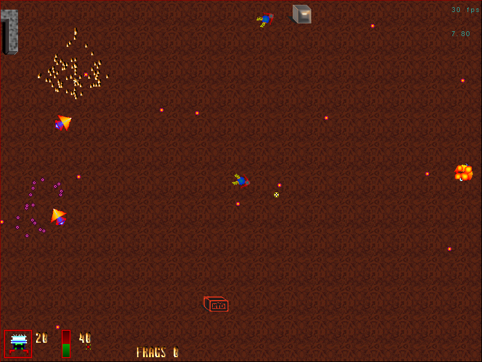

# flatwars
A 2D frag'em all game

_Horrible graphics!_ _Unbearable sound FX!_ _No introduction, no conclusion!_
(but so much fun to play!)



## Install, Compile and Run
On Ubuntu and other distributions, you will need to install a few libraries:
```shell
$ sudo apt-get install libsdl-image1.2-dev libsdl-ttf2.0-dev libsdl-mixer1.2-dev
```
and maybe other dependencies.

Then clone the repository:
```shell
$ git clone https://github.com/Metaxal/flatwars.git
```
Compile (sorry, no makefile):
```shell
$ cd flatwars
$ ./compile
```
Now it's ready to run:
```shell
$ ./flatwars
```

## Configuration files

You can use either the mouse or the keyboard, or both.
The some parameters such as screen resolution, keyboard configuration, board size, number of bots, etc. can be configured in the configuration file in the `cfg` directory.
By default, the `cfg/board.cfg` and `cfg/game.cfg` files are loaded. This can be changed on the command line with
```shell
$ ./flatwars -b <my-board-config-file> -g <my-game-config-file>
```

### Game config file (`cfg/game.cfg`)

`XMAX` and `YMAX` define the size in pixels of the window, and if `FULLSCREEN` is 0, then the game runs in windowed mode, and if it is 1, it runs in fullscreen mode.

### Board config file (`cfg/board.cfg`)

`NBCASESX` and `NBCASESY` are the number of cells on the X and Y coordinates.
`FLOOR_IMG` is the picture to use for the floor.
To add players to a board, add one or more lines with
```PLAYER=<PlayerClass> <ShipNumber> <Number>```, where the `PlayerClass` is the name of one of the strings registered in the function `initPlayers` in `players/players.cpp` (currently, `SimpleBot`, `Humain` or `AGBot`, the latter being for test only). Don't forget a line with the human player if you want to play and not just watch!

### Keyboard config file (`cfg/kb.cfg`)

The keys of the human player are defined in the (fixed) file `cfg/kb.cfg`. 
To help define the keys, the `cfg` directory also contains a `kb-config` program.
Compile it with
```shell
$ g++ -o kb-config kb-config.cpp -lSDL
```
then run it:
```shell
$ ./kb-config
```
The file `cfg/kb.cfg` will be overwritten with the keys you then press.
